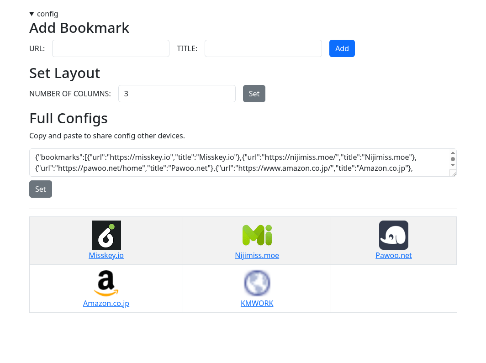

# simple-web-bookmark

simple web bookmark for new tab page

## Motivation
- New tab page bookmarks (like speed dial) are useful
- But browser extensions are unstable and a little bit problematic
- I want a simple web bookmark

## Features
- **Serverless**, only browser script
- PC/mobile compatible
- Import/export bookmarks

## Usage
- Deploy `docs/index.html` to your web server
- Or run test server `npm run dev`
- [github pages here](https://beatenavenue.github.io/simple-web-bookmark/)
  - For Chrome family browser: use like a speeddial with new tab extension [(ex)](https://chromewebstore.google.com/detail/icpgjfneehieebagbmdbhnlpiopdcmna)
